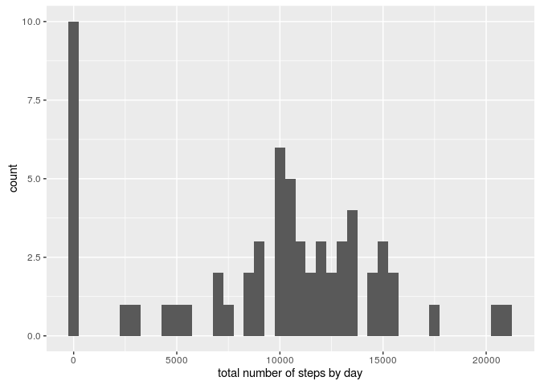

# Reproducible Research: Peer Assessment 1
Me  
May 13, 2016  


## Loading and preprocessing the data

The next code will first check whether the data already exists as a csv file. If it doesn't, we unzip it from the zip file to have it as a CSV file. Finally loads the data.


```r
if(!file.exists('activity.csv')){
    unzip('activity.zip')
}
data <- read.csv('activity.csv')
```

## What is mean total number of steps taken per day?


```r
library(ggplot2)
totalDay <- tapply(data$steps, data$date, FUN = sum, na.rm = TRUE)
qplot(totalDay, binwidth = 500, xlab = "total number of steps by day")
```

<!-- -->


```r
meanByDay <- mean(totalDay, na.rm = TRUE)
meanByDay
```

```
## [1] 9354.23
```

```r
medianByDay <- median(totalDay, na.rm = TRUE)
medianByDay
```

```
## [1] 10395
```

The mean and the average are, respectively, equal to 9354.2295082 and 10395.

## What is the average daily activity pattern?


```r
library(ggplot2)
averageSteps <- aggregate(x=list(steps=data$steps), by=list(interval=data$interval), FUN=mean, na.rm=TRUE)
ggplot(data = averageSteps, aes(x = interval, y = steps)) + geom_line() + xlab("5 minutes interval") + 
    ylab("average number of steps")
```

<!-- -->

To get the interval that contains the maximum number of steps, select the winning row from the table.


```r
maxAverage <- averageSteps[which.max(averageSteps$steps), ]
maxAverage
```

```
##     interval    steps
## 104      835 206.1698
```

And the winner is 835 with an average number of 206.1698113 steps.

## Imputing missing values


```r
totalNA <- sum(is.na(data$steps))
totalNA
```

```
## [1] 2304
```

There are 2304 missing values.

The following strategy fills all the missing values in with the corresponding 5 minutes interval. We end up with a new dataset `filledData´


```r
fillValue <- function(steps, interval) {
    filled <- NA
    if (!is.na(steps)) 
        filled <- c(steps) 
    else 
        filled <- (averageSteps[averageSteps$interval == interval, "steps"])
    return(filled)
}
filledData <- data
filledData$steps <- mapply(fillValue, filledData$steps, filledData$interval)
```


```r
newTotalDay <- tapply(filledData$steps, filledData$date, FUN = sum)
qplot(newTotalDay, binwidth = 500, xlab = "total number of steps per day")
```

<!-- -->


```r
mean(newTotalDay)
```

```
## [1] 10766.19
```

```r
median(newTotalDay)
```

```
## [1] 10766.19
```

explaination: TODO

## Are there differences in activity patterns between weekdays and weekends?


```r
filledData$day <-  ifelse(as.POSIXlt(filledData$date)$wday %in% c(0,6), 'weekend', 'weekday')
```


```r
library(ggplot2)
averagesDay <- aggregate(steps ~ interval + day, data = filledData, mean)
ggplot(averagesDay, aes(interval, steps)) + 
    geom_line() + 
    facet_grid(day ~ .) +
    xlab("5-minute interval") + 
    ylab("avarage number of steps")
```

<!-- -->
